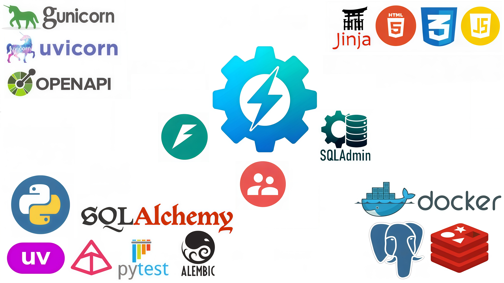

#  FastAPI-Boilerplate
**FastAPI Boilerplate** — это продвинутый базовый шаблон для быстрой разработки асинхронных веб-приложений. 
Проект спроектирован как надежный фундамент, объединяющий лучшие практики **Clean Architecture** и современный технологический стек Python.

Этот шаблон избавляет от рутины по настройке авторизации, базы данных, админки и Docker-окружения, 
позволяя вам сосредоточиться на реализации бизнес-идей с первых минут.



## 📚 Содержание
- [🛠️ Технологический стек](#-технологический-стек)
- [✅ Функционал](#-функционал)
- [📂 Структура проекта](#-структура-проекта)
- [⚙️ Установка и запуск](#-установка-и-запуск)
- [📬 Контакты](#-контакты)

## 🛠️ Технологический стек

| Компоненты | |
|----------|---:|
| **🐍 Язык:** Python 3.14+ | [](https://www.python.org/) |
| **⚡ Фреймворк:** FastAPI | [](https://fastapi.tiangolo.com/) |
| **🚀 ASGI-сервер:** Uvicorn + Gunicorn | [](https://www.uvicorn.org/) [](https://gunicorn.org/) |
| **🗄️ База Данных:** PostgreSQL (asyncpg) | [](https://www.postgresql.org/) |
| **🔁 ORM:** SQLAlchemy (async) | [](https://www.sqlalchemy.org/) |
| **🔄 Миграции БД:** Alembic | [](https://alembic.sqlalchemy.org/) |
| **🔐 Аутентификация:** FastAPI-Users | [](https://fastapi-users.github.io/fastapi-users/) |
| **🔧 Админка:** SQLAdmin | [](https://aminalaee.dev/sqladmin/) |
| **✅ Валидация:** Pydantic v2 + pydantic-settings | [](https://docs.pydantic.dev/) [](https://docs.pydantic.dev/latest/concepts/pydantic_settings/) |
| **🧩 Кэширование:** Redis + fastapi-cache2 | [](https://redis.io/) |
| **📄 Шаблонизация:** Jinja2 | [](https://jinja.palletsprojects.com/) |
| **🛡️ Защита:** slowapi + CORS | [](https://slowapi.readthedocs.io/) [](https://fastapi.tiangolo.com/tutorial/cors/) |
| **📧 Почта:** aiosmtplib | [](https://aiosmtplib.readthedocs.io/) |
| **📦 Менеджер пакетов:** uv | [](https://docs.astral.sh/uv/) |
| **🐳 Контейнеризация:** Docker + Docker Compose | [](https://www.docker.com/) [](https://docs.docker.com/compose/) |
| **🧪 Тестирование:** Pytest + httpx + faker | [](https://docs.pytest.org/) [](https://www.python-httpx.org/) [](https://faker.readthedocs.io/) |
| **📘 Документация:** OpenAPI (Swagger UI) | [](https://swagger.io/specification/) |
| **🧹 Форматирование кода:** Black | [](https://black.readthedocs.io/) |
| **📊 Покрытие тестами:** pytest-cov | [](https://pytest-cov.readthedocs.io/) |

## ✅ Функционал

- **🔐 Аутентификация и безопасность (FastAPI-Users)**
  > Полный цикл управления пользователями: регистрация, вход, верификация email и восстановление пароля.
  > Поддержка различных стратегий аутентификации и гибкая настройка прав доступа.
- **🛡️ Защита и контроль трафика (Slowapi)**
  > Встроенный `Rate Limiting` для защиты эндпоинтов от перегрузок и brute-force атак.
  > Настройка `CORS` для безопасного взаимодействия с фронтенд-приложениями.
- **🛠️ Профессиональная админ-панель (SQLAdmin)**
  > Полноценный интерфейс для управления данными: CRUD операции, фильтрация и поиск по всем моделям базы данных прямо в браузере.
- **🏗️ Современная архитектура (Clean Architecture)**
  > Разделение приложения на независимые слои: API, Services, Repositories и Models.
  > Легкая поддержка и масштабируемость кода благодаря инверсии зависимостей.
- **🚀 Высокая производительность (uv + orjson)**
  > Использование пакетного менеджера `uv` для мгновенной сборки окружения.
  > Ультра-быстрая сериализация данных через `orjson`.
- **🗄️ Работа с данными (SQLAlchemy 2.0)**
  > Полностью асинхронное взаимодействие с `PostgreSQL (asyncpg)`.
  > Универсальный базовый репозиторий для минимизации шаблонного кода при работе с БД.
- **🔄 Автоматизация миграций (Alembic)**
  > Управление схемами базы данных с поддержкой асинхронности.
  > Автоматический накат миграций при запуске контейнера.
- **📧 Асинхронные уведомления (aiosmtplib)**
  > Отправка системных и транзакционных писем (подтверждение регистрации, сброс пароля) без блокировки основного потока приложения.
- **🧩 Кэширование (Redis + fastapi-cache2)**
  > Интеграция с `Redis` для кэширования тяжелых запросов, что значительно снижает нагрузку на базу данных и ускоряет отклик API.
- **📦 Контейнеризация и DevOps (Docker)**
  > Готовая инфраструктура в `Docker Compose`: приложение, БД, Redis и PGAdmin запускаются одной командой.
  > Поддержка `Hot Reload` для быстрой разработки внутри контейнера через watch.
- **🧪 Надежное тестирование (Pytest)**
  > Настроенная среда для тестирования асинхронного API с использованием `HTTPX`.
  > Генерация фейковых данных через `Faker` и отчеты о покрытии кода через `pytest-cov`.
- **📘 Автодокументация (Swagger)**
  > Всегда актуальная интерактивная документация API по стандартам `OpenAPI`, доступная по адресу /docs.

## 📂 Структура проекта

```bash
fastapi-boilerplate/
├── app/                         # Основной пакет приложения
│   ├── actions/                 # CLI-скрипты управления (создание суперпользователя и др.)
│   ├── admin/                   # Конфигурация админ-панели SQLAdmin
│   ├── alembic/                 # История и версии миграций базы данных
│   ├── api/                     # Слой сетевых интерфейсов (API)
│   │   ├── api_v1/              # Первая версия REST API эндпоинтов
│   │   ├── dependencies/        # Инъекции зависимостей (Depends) для роутеров
│   │   ├── webhooks/            # Обработчики входящих уведомлений от внешних систем
│   │   └── __init__.py          # Агрегация и инициализация роутеров
│   ├── core/                    # Системное ядро и инфраструктурные компоненты
│   │   ├── auth/                # Конфигурация безопасности и логика fastapi-users
│   │   ├── cache/               # Настройки и утилиты кэширования (Redis)
│   │   ├── gunicorn/            # Конфигурация WSGI-сервера для продакшена
│   │   ├── config.py            # Валидация настроек через pydantic-settings (.env)
│   │   ├── db_helper.py         # Инициализация движка SQLAlchemy и сессий
│   │   ├── limiter.py           # Настройка ограничений частоты запросов (Rate Limiting)
│   │   └── templates.py         # Интеграция и конфигурация Jinja2Templates
│   ├── exceptions/              # Обработка исключений
│   │   ├── custom.py            # Определение пользовательских классов ошибок
│   │   └── handlers.py          # Глобальные обработчики исключений
│   ├── middleware/              # Кастомные middleware
│   ├── models/                  # Описание сущностей базы данных (ORM SQLAlchemy)
│   ├── repositories/            # Слой доступа к данным (Data Access Layer)
│   │   └── crud_manager.py      # Универсальный CRUD-менеджер для работы с моделями
│   ├── schemas/                 # Модели данных Pydantic (DTO) для валидации
│   ├── services/                # Слой бизнес-логики (UseCase Layer)
│   │   └── mailing/             # Почтовый сервис (рассылка уведомлений, подтверждений)
│   ├── static/                  # Статическое содержимое (CSS, JS, Изображения)
│   ├── templates/               # HTML-шаблоны (Jinja2)
│   ├── utils/                   # Вспомогательные функции общего назначения
│   │   └── case_converter.py    # Функция конвертации имени таблицы
│   ├── views/                   # Роутеры для рендеринга HTML-страниц (Frontend-интерфейс)
│   ├── .env                     # Переменные окружения (не отображается в git)
│   ├── .env.template            # Шаблон .env (автоматически заменяет .env, если его нет)
│   ├── alembic.ini              # Конфигурационный файл миграций Alembic
│   ├── create_fastapi_app.py    # Фабрика для сборки и настройки экземпляра FastAPI 
│   ├── main.py                  # Точка входа для запуска в режиме разработки
│   ├── run.py                   # Запуск приложения через Gunicorn (для Docker)
│   └── run_main.py              # Создания и запуск приложения через Gunicorn
├── docker-build/                # Инфраструктурные файлы сборки
│   └── app/
│       ├── Dockerfile           # Инструкции для сборки Docker-образа
│       └── prestart.sh          # Скрипт подготовки БД (миграции + создание админа)
├── tests/                       # Пакет с автоматизированными тестами (Pytest)
├── docker-compose.yml           # Оркестрация контейнеров (App, DB, Redis, PGAdmin)
├── pyproject.toml               # Конфигурация проекта, зависимостей и инструментов (uv)
└── uv.lock                      # Фиксированные версии установленных пакетов
```

## ⚙️ Установка и запуск

1. **Клонируйте репозиторий**
> В терминале выполните команду:
> ```bash
> git clone https://github.com/Mishchenko-Vladimir/fastapi-boilerplate.git
> ```
> Перейдите в директорию проекта:
> ```bash
> cd fastapi-boilerplate
> ```

2. **Настройка переменных окружения**
> Заполните файлы `.env.template` и `docker-compose.yml` своими значениями.

3. **Ваша разработка и настройка приложения**
> Синхронизируйте виртуальное окружение проекта с зависимостями:
> ```bash
> uv sync
> ```
> Просто редактируйте и добавляйте новые файлы в папку `app/`, и изменения автоматически применятся в запущенном контейнере.
>
> Локальный запуск (без `Docker`):
> ```bash
> uv run python app/main.py
> ```

4. **Запуск приложение через Docker**
> Сборка образа с именем `app`:
> ```bash
> docker compose build app
> ```
> Запуск сборки (приложения):
> ```bash
> docker compose up -d
> ```
> Остальные команды `docker`:
> - `docker compose ps` — посмотреть какие контейнеры запущены
> - `docker compose logs -f app` — посмотреть логи приложения
> - `docker compose stop` — остановка приложения
> - `docker compose down` — удаления сборки

> Приложение будет доступно по адресу http://localhost:8000, а документация http://localhost:8000/docs 

## 📬 Контакты

### 💻 Автор: Мищенко Владимир
- **GitHub:** [Mishchenko-Vladimir](https://github.com/Mishchenko-Vladimir)
- **Mail.ru:** [mishchienko.2001@mail.ru](mailto:mishchienko.2001@mail.ru)
- **Gmail:** [mishchieko.2001@gmail.com](mailto:mishchieko.2001@gmail.com)
- **Telegram:** [@VM_Dev](https://t.me/VM_Dev)

💌 Не забудьте поставить звезду ⭐ на GitHub, если вам понравился проект! 😉

---
[↑ Вернуться наверх](#-fastAPI-boilerplate)
